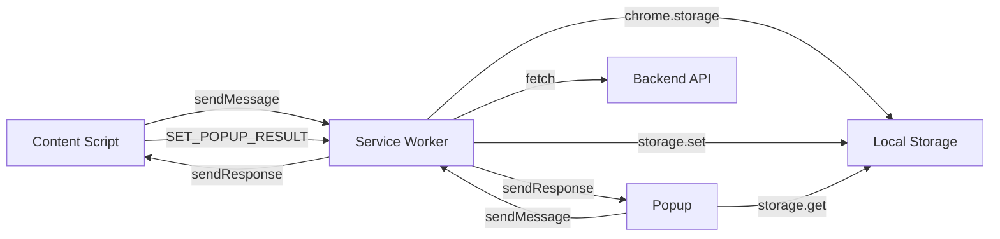
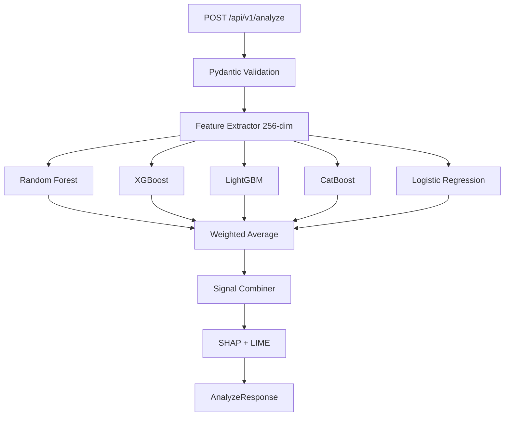
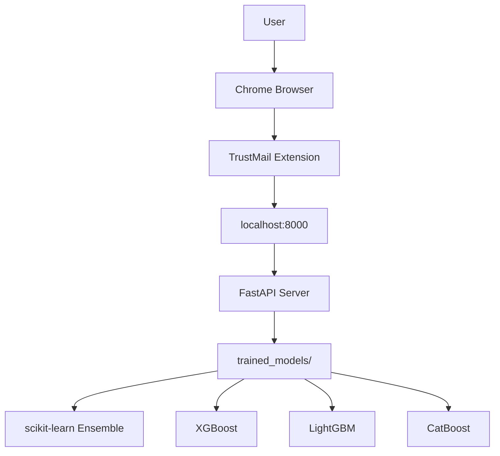

# TrustMail — System Architecture

## Overview

TrustMail is a Chrome Extension that performs **100% local email threat analysis** using a classical ML ensemble. No email data ever leaves the user's device. No deep learning or GPU required.

```
┌──────────────────────────────────────────────────────────┐
│                     User's Browser                        │
│                                                          │
│  ┌─────────────────────────────────────────────────────┐ │
│  │              Chrome Extension (MV3)                  │ │
│  │                                                      │ │
│  │  ┌──────────────┐   ┌──────────────┐  ┌──────────┐  │ │
│  │  │ Content      │   │ Background   │  │  Popup   │  │ │
│  │  │ Scripts      │◄──│ Service      │◄─│  UI      │  │ │
│  │  │ (per-provider│   │ Worker       │  │          │  │ │
│  │  │  + inbox     │──►│              │──►│          │  │ │
│  │  │  scanner)    │   │              │  │          │  │ │
│  │  └──────────────┘   └──────┬───────┘  └──────────┘  │ │
│  └────────────────────────────│────────────────────────┘ │
│                               │ HTTP (localhost only)     │
└───────────────────────────────│──────────────────────────┘
                                │
        ┌───────────────────────▼──────────────────────────┐
        │              TrustMail Backend (FastAPI)           │
        │                                                    │
        │  ┌──────────┐  ┌─────────────────────────────┐    │
        │  │ Feature  │  │  Classical Ensemble (CPU)    │    │
        │  │ Engineer.│─►│  RF + XGB + LGB + Cat + LR  │    │
        │  └──────────┘  └──────────────┬──────────────┘    │
        │                               │                    │
        │               ┌───────────────▼──────────────┐    │
        │               │  Signal Combination + SHAP    │    │
        │               │  (header + URL + NLP weights) │    │
        │               └──────────────────────────────┘    │
        └────────────────────────────────────────────────────┘
```

> **No deep learning.** The architecture intentionally uses only classical ML (Random Forest, XGBoost, LightGBM, CatBoost, Logistic Regression) to keep the system fast, lightweight, and fully local.

---

## Component Responsibilities

### Chrome Extension

| Component | File | Responsibility |
|---|---|---|
| Inbox Scanner | `content/inbox-scanner.js` | Shared engine; injects risk pills into inbox rows |
| Gmail Script | `content/gmail.js` | Gmail DOM extraction + inbox integration |
| Outlook Script | `content/outlook.js` | Outlook DOM extraction + inbox integration |
| Yahoo Script | `content/yahoo.js` | Yahoo DOM extraction + inbox integration |
| ProtonMail Script | `content/proton.js` | ProtonMail DOM extraction + inbox integration |
| Service Worker | `background/service-worker.js` | API proxy, caching, badge updates, history |
| Popup | `popup/index.html` + `popup/popup.js` | Dashboard UI with tabs |
| Options | `options/index.html` + `options/options.js` | Settings management |

### Backend

| Component | Path | Responsibility |
|---|---|---|
| Entry Point | `app.py` | Uvicorn launcher |
| FastAPI App | `api/app.py` | Route registration, middleware, lifespan |
| Analyze Route | `api/routes/analyze.py` | `POST /api/v1/analyze` |
| Email Analyzer | `api/services/email_analyzer.py` | Orchestrates full pipeline |
| Feature Extractor | `preprocessing/feature_extractor.py` | 256-dim feature vector |
| Ensemble Service | `api/services/ensemble.py` | Weighted average of 5 classical models |
| Model Loader | `inference/model_loader.py` | Loads/caches models on startup |
| SHAP Explainer | `api/explainability/shap_explainer.py` | Feature importance |
| LIME Explainer | `api/explainability/lime_explainer.py` | Word-level contributions |
| Training Script | `training/run_training.py` | Generates data + trains all models |

---

## Data Flow

### Inbox Scan (Lightweight)
```
User opens Gmail inbox
  └─ inbox-scanner.js detects email rows (tr.zA)
       └─ Extracts: subject, sender (no body)
            └─ ANALYZE_INBOX_ROW → service worker
                 └─ POST /api/v1/analyze { subject, sender, bodyText:"" }
                      └─ Feature extraction (header-only features)
                           └─ Classical ensemble prediction (~8ms)
                                └─ Risk pill injected into inbox row
                                     └─ Tooltip on hover; popup on click
```

### Full Email Scan
```
User opens an email
  └─ gmail.js detects [data-message-id] element
       └─ Extracts: subject, sender, body, URLs, headers
            └─ ANALYZE_EMAIL → service worker
                 └─ POST /api/v1/analyze { full payload }
                      └─ Feature engineering (256-dim vector)
                           └─ Classical ensemble (RF + XGB + LGB + Cat + LR)
                                └─ Signal combination (headers + URLs + NLP)
                                     └─ SHAP + LIME explanations (if requested)
                                          └─ Floating badge shown
                                               └─ Popup shows full report
```

---

## Architecture Diagrams

### Extension Messaging



### Backend Request Pipeline



### Deployment Topology



---

## Key Design Decisions

| Decision | Rationale |
|---|---|
| **Classical ML only** | No ONNX/PyTorch dependency; runs on any Python 3.10+ CPU machine |
| **Local-only inference** | Privacy requirement — email content never sent to cloud |
| **256-dim dense features** | Fixed-size vector; works without a pre-fitted TF-IDF vectorizer |
| **MV3 Service Worker** | Chrome MV3 requirement; enables reliable background API calls |
| **Shared inbox-scanner.js** | Single engine avoids code duplication across 4 provider scripts |
| **WeakMap deduplication** | DOM elements as keys prevent memory leaks and double-scanning |
| **requestIdleCallback** | Scans yield to browser to prevent jank during inbox scrolling |
| **5-min result cache** | Avoids rescanning recently-seen emails |
| **Heuristic confidence cap** | Heuristic mode caps confidence at 75% to signal lower reliability |
